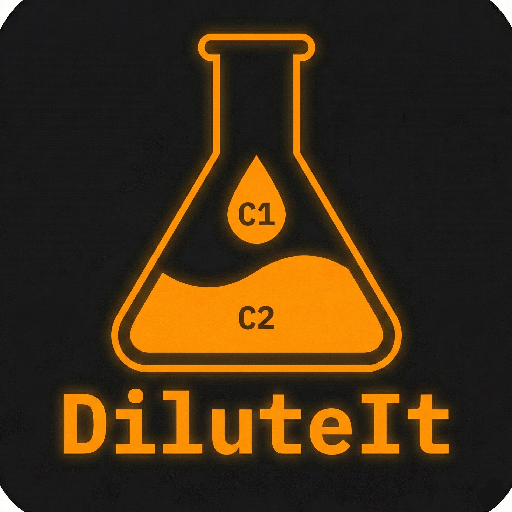

<div align="center">

# DiluteIt

### Universal dilution solver for lab and bioprocess workflows

<a href="https://ebalderasr.github.io/DiluteIt/">
  
</a>

<br>

**[→ Open the live app](https://ebalderasr.github.io/DiluteIt/)**

<br>

[]()
[]()
[](./LICENSE)
[](https://github.com/ebalderasr)

</div>

---

## What is DiluteIt?

DiluteIt is a **browser-based dilution calculator** that solves for any one of the four variables in the dilution equation. You choose the unknown — C1, V1, C2, or V2 — provide the other three values with their units, and the app returns the result immediately.

It handles unit conversion within compatible concentration bases (M · mM · μM, mg/mL, %) and validates that the inputs are physically consistent before computing.

No installation. No server. Runs entirely in the browser.

---

## Why it matters

Dilution calculations are among the most frequent arithmetic tasks at the bench, yet they are also a common source of pipetting and transcription errors. Without a dedicated tool:

- Four different rearrangements of $C_1V_1 = C_2V_2$ must be recalled or derived on the fly
- Unit scaling (M → mM → μM) adds an error-prone manual step
- There is no validation that the concentration bases on both sides are compatible
- Results written on scratch paper get lost or misread under lab conditions

DiluteIt eliminates all four problems in a single, mobile-ready interface.

---

## How it works

### Solving for any variable

Select the unknown, enter the three known values, choose units, and click **Solve**:

| Unknown | What you provide | Typical use case |
|---|---|---|
| V1 | C1, C2, V2 | How much stock to pipette for a working solution |
| C1 | V1, C2, V2 | Back-calculating the concentration of an unknown stock |
| C2 | C1, V1, V2 | What concentration results from a given dilution |
| V2 | C1, V1, C2 | What final volume a fixed aliquot can reach at a target density |

### Unit handling

DiluteIt converts within compatible concentration bases automatically:

| Basis | Accepted units |
|---|---|
| Molar | M, mM, μM |
| Mass/volume | mg/mL |
| Percentage | % |

C1 and C2 must share the same concentration basis. Cross-basis conversions (e.g. M → mg/mL) require additional data such as molecular weight or density and are outside the scope of the dilution equation.

Volume units (L, mL, μL) are handled independently and can differ between V1 and V2.

---

## Methods

The app applies the conservation of solute amount:

$$C_1 V_1 = C_2 V_2$$

Rearranged for each unknown:

$$V_1 = \frac{C_2 \times V_2}{C_1} \qquad C_1 = \frac{C_2 \times V_2}{V_1}$$

$$C_2 = \frac{C_1 \times V_1}{V_2} \qquad V_2 = \frac{C_1 \times V_1}{C_2}$$

---

## Features

| | |
|---|---|
| **Universal solver** | Solves for any of the four variables: C1, V1, C2, V2 |
| **Unit-aware** | Handles M · mM · μM · mg/mL · % and L · mL · μL |
| **Compatibility validation** | Warns when C1 and C2 use incompatible concentration bases |
| **Offline-first PWA** | Service Worker caches all assets; works without internet after first load |
| **Bilingual UI** | Full Spanish / English interface |
| **No installation** | Opens instantly in any modern browser; installable on Android, iOS, and desktop |

---

## Tech stack

**Frontend**


**Deployment**


Fully static — no backend, no framework, no build step.

---

## Project structure

```
DiluteIt/
├── index.html              ← markup only
├── manifest.json           ← PWA manifest
├── sw.js                   ← Service Worker (cache-first, offline support)
├── icon-192.png
├── icon-512.png
├── icon-maskable-192.png
├── icon-maskable-512.png
└── src/
    ├── css/
    │   └── app.css         ← all styles
    └── js/
        ├── i18n.js         ← translation strings (ES / EN)
        └── app.js          ← all application logic
```

---

## Author

**Emiliano Balderas Ramírez**
Bioengineer · PhD Candidate in Biochemical Sciences
Instituto de Biotecnología (IBt), UNAM

[](https://www.linkedin.com/in/emilianobalderas/)
[](mailto:ebalderas@live.com.mx)

---

## Related

[**CellSplit**](https://github.com/ebalderasr/CellSplit) — Neubauer cell counting and passage planning for CHO cultures.

[**Kinetic Drive**](https://github.com/ebalderasr/Kinetic-Drive) — interactive kinetic analysis for mammalian cell culture data.

[**Clonalyzer 2**](https://github.com/ebalderasr/Clonalyzer-2) — fed-batch kinetics analysis with clone comparisons and publication-ready plots.

[**CellBlock**](https://github.com/ebalderasr/CellBlock) — shared biosafety cabinet scheduling for cell culture research groups.

---

<div align="center"><i>DiluteIt — pick your unknown, get your answer.</i></div>
